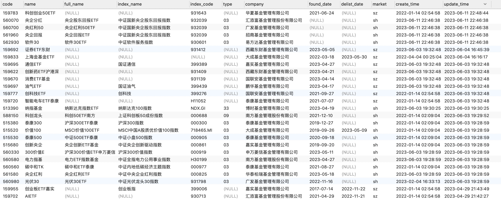
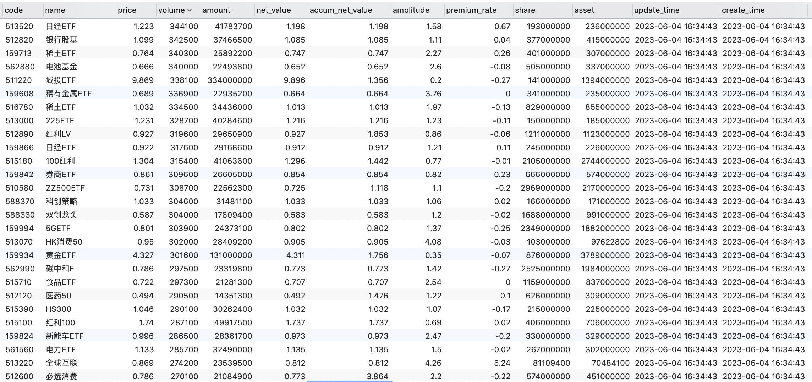

# etf-crawler

A 股 ETF&amp;行情指标爬取

## 数据

### ETF 基础信息表



### ETF 行情指标表



## 运行

1. `pip3 install -r requirements.txt`

2. 从环境参数模板（.env.example）中复制一份文件（.env）,修改本地环境变量

   > `cp .env.example .env`
   > 输入自己的数据库信息

3. 建表

   - `etf_fund`数据表
     使用 sql 语句创建数据表

   ```sql
    CREATE TABLE `etf_fund` (
    `id` bigint unsigned NOT NULL COMMENT '唯一id， 雪花算法',
    `code` varchar(10) NOT NULL COMMENT '证券代码',
    `name` varchar(24) NOT NULL COMMENT '证券名称',
    `full_name` varchar(24)  COMMENT '证券全称',
    `index_name` varchar(24)  COMMENT '拟合指数名称',
    `index_code` varchar(24)  COMMENT '拟合指数代码',
    `type` varchar(10)  COMMENT '基金类别,深证的etf还没有数据, 01-单市场ETF, 03,08-跨市场ETF, 04-跨境ETF, 02-债券, 06-黄金ETF, 09-单市场科创板ETF, 31-跨市场科创板ETF',
    `company` varchar(36) NOT NULL COMMENT '基金公司',
    `market` varchar(24) NOT NULL COMMENT '证券所市场',
    `create_time` datetime NOT NULL DEFAULT CURRENT_TIMESTAMP COMMENT '创建时间',
    `update_time` timestamp NOT NULL DEFAULT CURRENT_TIMESTAMP ON UPDATE CURRENT_TIMESTAMP,
    PRIMARY KEY (`id`),
    UNIQUE KEY `uni_code` (`code`)
    ) ENGINE=InnoDB DEFAULT CHARSET=utf8mb4 COLLATE=utf8mb4_0900_ai_ci

   ```

   - 建立`etf_indicator` 表
     该表使用 sqlalchemy ORM 建立，运行`python3 models/etf_indicator.py`中`create()`即可

4. 执行`python3 main.py`选择要操作命令即可即可
